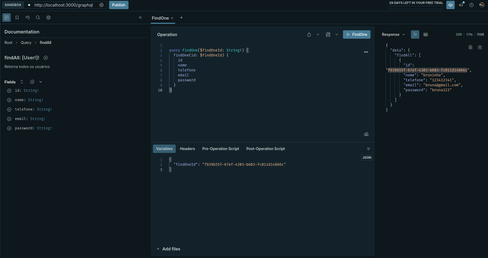

  <h1 align="center">Moonkey Finanças API</h1>
  

  
  

[circleci-image]: https://img.shields.io/circleci/build/github/nestjs/nest/master?token=abc123def456
[circleci-url]: https://circleci.com/gh/nestjs/nest

## Description

API GraphQl desenvolvida com Nest.js, tem como proposta gestão de vendas e pedidos focado no ramo comercial. Com ela, posso registrar, atualizar, deletar e consultar pedidos e vendas

## Tecnologias

 - <b>Nest js</b>
 - <b>TypeORM</b>
 - <b>Typescript</b>
 - <b>GraphQL</b>
 - <b>JWT</b>

## Funcionalidades

- [X] Gerenciamento de usuário

  - [X] Crud com inserção, atualização, listagem e exclusão de usuários
  - [X] Implementação da autenticação de usuários com JWT
  - [X] Aplicar Guard de autenticação em rotas protegidas

- [X] Gereciamento de produtos
  - [X] Crud com inserção, atualização, listagem e exclusão de Produtos
  
- [X] Gereciamento de Vendas
  - [X] Crud com inserção, atualização, listagem e exclusão de vendas
  
- [x] Correção de Bug do Guard de cheacagem de autenticação de usuários
  - [x] implementação do AuthGuard em todos os módulos que necesitam de atenticação para liberação de acesso

- [x] Implementar module para uploud de arquivos
  - [ ] testar a rota de uplouds no cliente 

- [ ] Implementar cacheamento de dados nos modules

- [ ] Tratamento de erros

...

## Fale comigo

- Author - [Bruna Cardoso](https://kamilmysliwiec.com)
- Documentação - [https://nestjs.com](https://nestjs.com/)
- LinkedIn - [@nestframework](https://twitter.com/nestframework)
