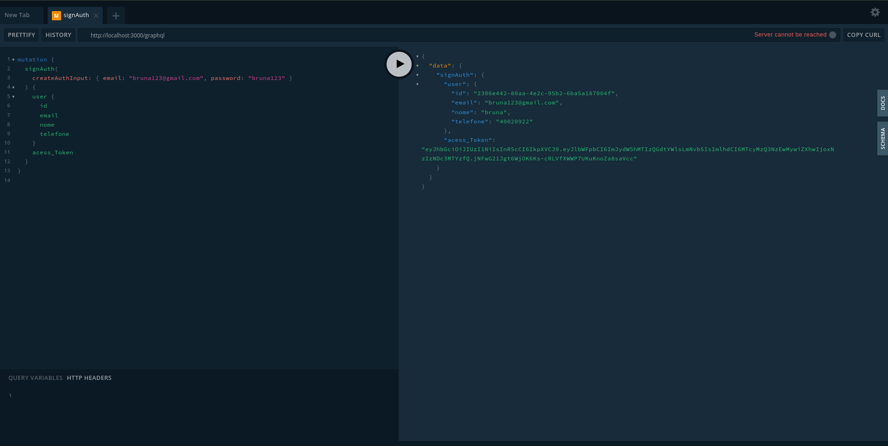

  <h1 align="center">Moonkey Finanças API</h1>
  

  
  

[circleci-image]: https://img.shields.io/circleci/build/github/nestjs/nest/master?token=abc123def456
[circleci-url]: https://circleci.com/gh/nestjs/nest

## Description

Api RestFull desenvolvida com Nest.js e GraphQl, tem como proposta gestão de vendas e pedidos focado no ramo comercial. Com ela, posso registrar, atualizar, deletar e consultar pedidos e vendas.

## Tecnologias

 - <b>Nest js</b>
 - <b>TypeORM</b>
 - <b>Typescript</b>
 - <b>GraphQL</b>
 - <b>JWT</b>

## Funcionalidades

- [ ] Gerenciamento de usuário

  - [X] Crud com inserção, atualização, listagem e exclusão de usuários
  - [X] Implementação da autenticação de usuários com JWT
  - [ ] Aplicar Guard de autenticação em rotas protegidas

- [ ] Gereciamento de produtos
- [ ] Gereciamento de vendas de produtos

## Fale comigo

- Author - [Bruna Cardoso](https://kamilmysliwiec.com)
- Documentação - [https://nestjs.com](https://nestjs.com/)
- LinkedIn - [@nestframework](https://twitter.com/nestframework)
